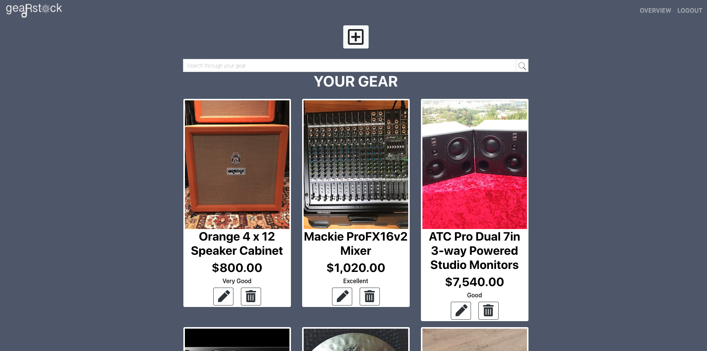
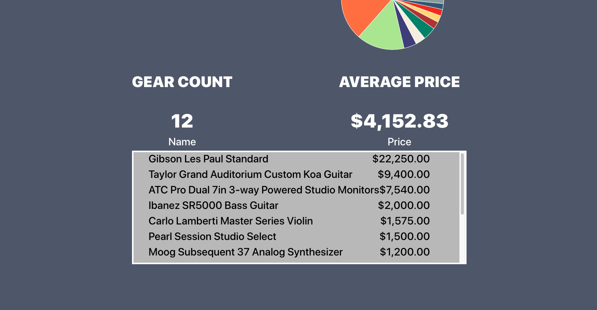

This project was bootstrapped with [Create React App](https://github.com/facebook/create-react-app).

# Gear Stock

## Description 

Gear Stock is a way for musicians to manage and track the gear, or musical instruments, that they own. The primary user is the musician. When a musician logs into the app, they will see all of the musical instruments or gear that they've added. They will have the option to “Add Gear” to their collection. Additionally, within each gear card, they will have the option to update or delete the gear.

Musicians need an app where they can quickly go to see what they have to sell, lend out, its condition, warranty terms, when and where they got it, its value, and does it need to go. 

## Technologies Used:

 * HTML5 
 * CSS 
 * JavaScript 
 * Bootstrap 4 
 * ES6 Modules
 * React
 * Firebase
 * Font Awesome
 * Axios 
 * Sass
 * Webpack
 * Recharts 
 * React Search Field

## Live Demo 

[Gear Stock](https://gear-stock.firebaseapp.com/)

## Screenshots

## How to Run this Project 

* Setup Firebase

    * Create a firebase project
    * Enable Google Authentication
    * Create a Firebase Realtime Database. import !base.json and you will see data for gear
    * Click on Gear, and the import the gear.json file.
    * Go to Database tab and click on Rules tab, and add the following rule: "gear": { ".indexOn":"uid" },
* Clone the repository

* Change it to repository directory in your terminal

* At the root of the project run npm install to install necessary dependencies

* Create an apiKeys.js file (refer to apiKeys.js.example for an example)

* do npm start to run the project at http://localhost:3000

## Contributors

 * [Colin White](https://github.com/colinlwhite)
